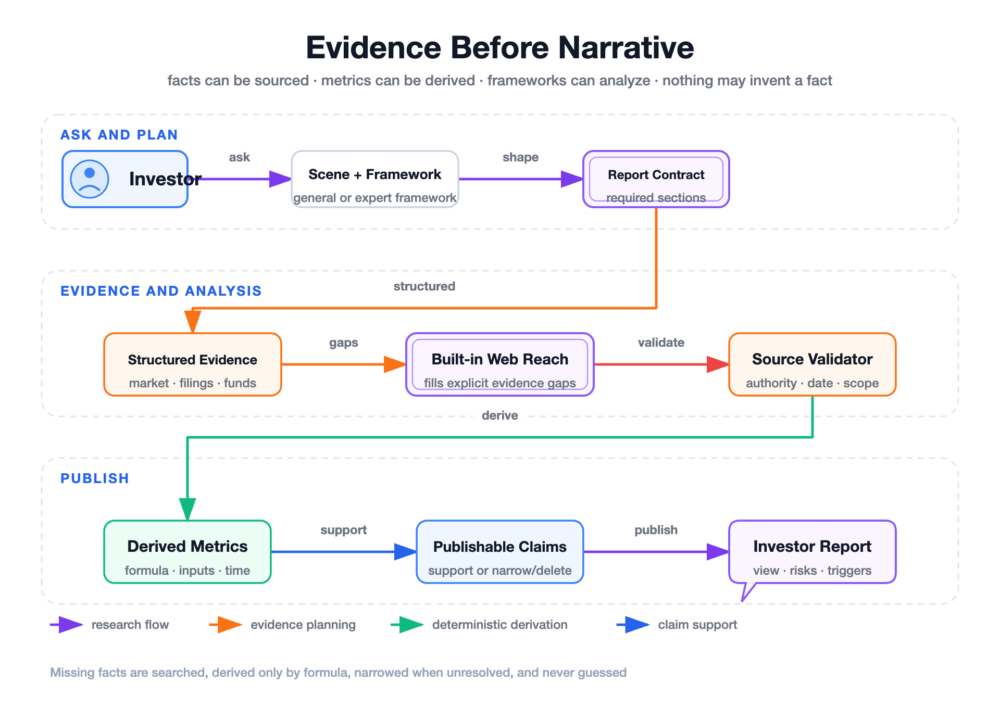
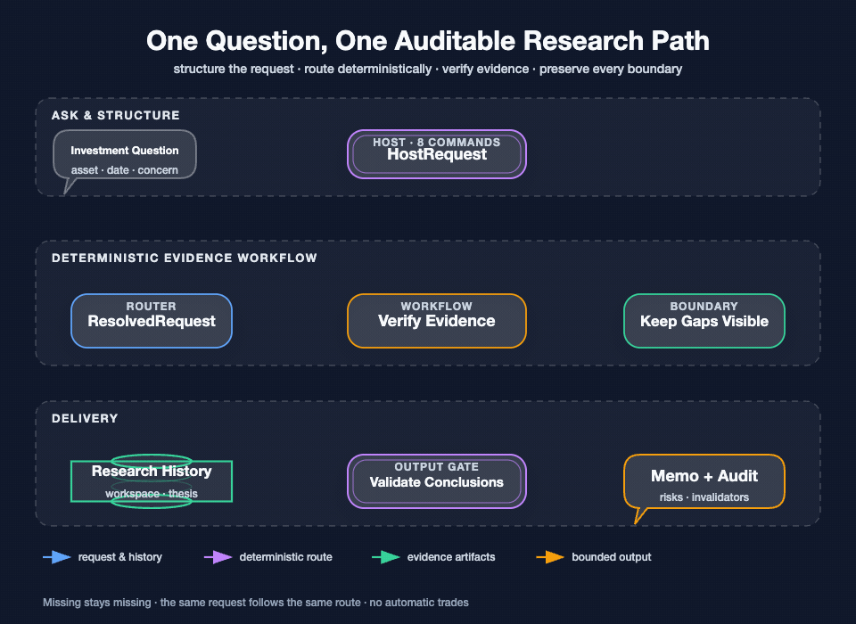

# stock-analysis

<div align="center">
  <a href="./README.md">English</a> |
  <a href="./README.zh-CN.md">简体中文</a>
</div>

<p align="center">
  <a href="https://github.com/AdvancingTitans/stock-analysis/releases/tag/v5.0.0"></a>
  <a href="https://github.com/AdvancingTitans/stock-analysis/actions/workflows/ci.yml"></a>
  <a href="https://www.python.org/"></a>
  <a href="LICENSE"></a>
</p>

<p align="center">
  
</p>

<p align="center">
  <strong>One investment question in. One investor-ready research report out.</strong>
</p>

<p align="center">
  Stocks · Funds and ETFs · Markets · Earnings · Price moves · Screens · Portfolios · Theses
</p>

<p align="center">
  <a href="https://github.com/thuquant/awesome-quant"></a>
  <a href="https://github.com/leoncuhk/awesome-quant-ai"></a>
  <a href="https://github.com/wangzhe3224/awesome-systematic-trading"></a>
  <a href="https://github.com/0xNyk/awesome-hermes-agent"></a>
</p>

Current CLI version: `5.0.0`

`stock-analysis` is an open-source investment research system, not an AI stock picker and not an auto-trading tool. Ask in plain language. The system identifies the research scene, obtains public evidence, validates source and time boundaries, derives only reproducible metrics, applies the appropriate financial framework, and delivers a professional report.

This is more than a richer market summary. It puts the complete investor workflow into one product: define the question, acquire and validate evidence, apply the appropriate financial framework, and deliver a view, valuation, risks, and action conditions. A material data boundary is summarized separately only when it changes the conclusion.

## See it in 72 seconds

<p align="center">
  <a href="promo/demo-video/out/stock-analysis-demo-en.mp4"></a>
  <a href="promo/demo-video/out/stock-analysis-demo-zh-CN.mp4"></a>
</p>

[Watch in English](promo/demo-video/out/stock-analysis-demo-en.mp4) · [Watch in Simplified Chinese](promo/demo-video/out/stock-analysis-demo-zh-CN.mp4) · [Edit the Remotion source](promo/demo-video/)

## What an investor gets

| Question | Research performed | Default delivery |
|---|---|---|
| “Analyze Kweichow Moutai 600519.” | Business model, competition, financial quality, valuation, catalysts, risks, and action conditions | Complete company Standard report |
| “Is this ETF suitable as a core holding?” | Index or strategy, holdings, factor exposure, drawdown, fees, liquidity, and portfolio role | Fund/ETF report |
| “What happened in A-shares today?” | Indices, breadth, style rotation, turnover, drivers, scenarios, and next-session signals | Market report |
| “Did this earnings release change the thesis?” | Comparable periods, margins, cash flow, guidance, expectation gaps, and valuation impact | Earnings review |
| “Why did this stock move sharply?” | Timeline, confirmed events, related explanations, market structure, and falsification signals | Price-move review |
| “Use Buffett and Soros as opposing frameworks.” | Two independent frameworks, targeted dispute evidence, conflicts, and future deciding signals | Adversarial framework report |

## Install

### Agent users

```bash
uv tool install stock-analysis
stock-analysis-agent install all
```

Restart the Agent host, then ask in plain language:

```text
Analyze Kweichow Moutai 600519.
Deeply research CATL 300750 and include peer and scenario analysis.
Review semiconductor ETF 512480 as a portfolio satellite.
Use Buffett's framework to analyze Moutai.
Compare Buffett and Soros as opposing frameworks on Moutai.
Recap today's A-share market.
```

Intent matching happens in the host Agent. The installer manages Codex and Claude Code entrypoints; the repository also ships generic Skill artifacts for other hosts to load through their own mechanisms. `stock-analysis-agent doctor all` checks installation; `stock-analysis-agent uninstall all` removes only managed files.

### CLI users

```bash
uv tool install stock-analysis

stock-analysis --market stock --symbol 600519
stock-analysis --market fund --symbol 512480
stock-analysis --market research --symbol 600519 --asset-type company --depth standard
stock-analysis --market research --symbol 512480 --asset-type fund --depth deep
stock-analysis --market a --depth standard
stock-analysis --market earnings --symbol 600519 --depth standard
stock-analysis --market price-move --symbol 300750 --depth standard
```

Use `stock-analysis --help` for all deterministic CLI parameters.

## Two research paths

### General research: Quick, Standard, Deep

If no expert framework is requested, the scene selects a fixed investor-facing report contract:

| Mode | Investor need | Research permission |
|---|---|---|
| Quick | “Give me the direction now.” | Core facts, valuation/price anchor, main risks, and next signals |
| Standard | Default complete research | Full scene-specific report, comparisons, valuation, catalysts, risks, and conditional actions |
| Deep | Material decision support | Cross-source verification, multi-period and peer work, multiple valuation methods, scenarios, and counter-case review |

Quick is not a truncated Standard report. Deep is not a longer Standard report. Each scene and depth has a deterministic section contract. The repository currently ships 21 contracts across:

- company;
- fund and ETF;
- market;
- earnings;
- price move;
- portfolio;
- screening.

Examples:

- Company Standard: conclusion → business model → thesis → competition → financial quality → valuation → catalysts → risks → action framework.
- Fund Standard: portfolio role → strategy → return sources → risk → holdings → management/tracking → market fit → entry/hold/exit conditions.
- Market Standard: conclusion → breadth → style/industry → liquidity → drivers → sentiment → scenarios → next-session watchlist.

### Expert framework research

An explicit expert, investment school, opposing view, or committee request enters a separate research path. It does not inherit the General Deep template.

Each expert framework is a research protocol with its own questions, evidence priorities, valuation methods, risk model, falsification rules, and report structure:

| Framework | Primary focus |
|---|---|
| Buffett | Business quality, moat, capital allocation, owner earnings, margin of safety |
| Munger | Mental models, incentives, inversion, opportunity cost |
| Graham | Balance-sheet safety, earnings stability, downside protection |
| Klarman | Absolute return, complexity discount, catalysts, permanent loss |
| Peter Lynch | Company category, understandable growth story, PEG, execution |
| O'Neil | Earnings acceleration, leadership, institutional demand, price strength |
| Cathie Wood | Disruptive innovation, adoption, cost curves, financing risk |
| Ray Dalio | Macro cycle, liquidity, diversification, risk balance |
| Soros | Reflexivity, expectations, policy turns, asymmetric positioning |
| Livermore | Trend, pivotal points, confirmation, loss control |
| Minervini | Trend template, earnings acceleration, leadership, risk/reward |
| Simons | Data definition, repeatability, out-of-sample robustness, trading cost |
| Duan Yongping | Business model, culture, long-term cash generation, fair price |
| Zhang Kun | High-quality business, free cash flow, competition, opportunity cost |
| Feng Liu | Market perception, odds, reversal, marginal change |

Supported forms:

- a single expert framework;
- parallel frameworks with shared conclusions and real differences;
- two-framework adversarial research with targeted dispute evidence;
- committee research only when explicitly requested.

The output is a synthesized report, never a transcript of role-play or invented expert quotations.

## Evidence before narrative



Public-web evidence acquisition is built into `stock-analysis`; installing the main package is sufficient for the basic research path.

The evidence plane includes:

- structured public market and filing connectors;
- bounded web search and direct/fallback page reading;
- source quality and publication/effective-date validation;
- primary-source preference for critical facts;
- silent provider fallback and failure isolation;
- query budgets for Quick, Standard, Deep, and expert-framework research.

The publication rules distinguish:

1. **Fact** — directly supported by a cited or frozen source.
2. **Derived fact** — calculated from supported inputs with an explicit formula and matching time boundary.
3. **Analysis** — interpretation, scenario, or financial-model conclusion.

A model may complete an analysis chain; it may never invent a missing fact. For example, market capitalization may be derived from a valid price and contemporaneous share count. If that still fails, only valuation methods that depend on it are degraded; the business, financial, risk, and conditional-action sections still publish.

## How the system works



[Open the static architecture](assets/diagrams/investor-research-architecture-en.png) · [Open the static research flow](assets/diagrams/investor-research-flow-en.png)

The architecture is organized around three investor questions:

- what asset and investment question must be understood;
- which facts have been verified and which conclusions they support;
- how valuation, risk, and expert frameworks translate into actionable monitoring conditions.

The final report organizes the core view, value assessment, main risks, and action conditions into one investor-readable deliverable.

## Commands

| Agent command | Purpose |
|---|---|
| `/market` | Market recap and scenarios |
| `/snapshot` | Deterministic quote, price/volume, and disclosed-fact snapshot |
| `/analyze` | Company or fund research |
| `/earnings` | Earnings review |
| `/move` | Price-move explanation |
| `/screen` | Auditable screening |
| `/portfolio` | Holdings, exposures, stress, and rebalancing |
| `/thesis` | Create, review, compare, update, or invalidate a thesis |

Older command names remain compatibility forwards. Normal users receive the report directly. Explicit debug mode is for developers and reviewers.

## Markets and boundaries

- Stocks: A/HK/US/JP/KR.
- Funds: public funds and ETFs, including strategy, holdings, fees, manager/tracking, and liquidity.
- Markets: session-aware market reports with no out-of-range trading-day guesses.
- Portfolios: no personalized weight recommendation without complete holdings and risk context.
- Public evidence: no missing value becomes zero; a stale holding is not described as real-time; community opinion cannot independently support a financial fact.

This project does not place orders, scrape private accounts, or promise returns. Reports are research material, not individualized investment advice.

## Release acceptance

The v5.0 release gate includes a 21-report real-business matrix:

```bash
uv run python scripts/run_business_acceptance.py \
  --date 20260717 \
  --output-dir /tmp/stock-analysis-acceptance \
  --external-evidence auto \
  --manual-audit-file docs/release-acceptance-v5.0.0-manual.json
```

It generates Quick, Standard, and Deep reports for:

- Kweichow Moutai 600519;
- CATL 300750;
- active fund 110011;
- semiconductor ETF 512480;
- A-share market;
- an earnings review;
- a real price-move review.

Every report must execute successfully, follow its fixed section contract, state a clear investment conclusion, use correct data periods, and pass a 100-point investor scorecard. A score below 85 or any veto condition fails the release gate. See the full record in [`docs/release-acceptance-v5.0.0.md`](docs/release-acceptance-v5.0.0.md).

## Development

```bash
git clone https://github.com/AdvancingTitans/stock-analysis.git
cd stock-analysis

uv run --with pytest pytest -q
uv run --with ruff ruff check .
python3 scripts/sync_agent_entrypoints.py --check
```

Architecture and flow assets are generated from semantic Fireworks sources in [`assets/diagrams`](assets/diagrams/). The bilingual product video is editable in [`promo/demo-video`](promo/demo-video/).

## Community

Recognition: [thuquant/awesome-quant #48](https://github.com/thuquant/awesome-quant/pull/48) · [leoncuhk/awesome-quant-ai #39](https://github.com/leoncuhk/awesome-quant-ai/pull/39) · [awesome-systematic-trading #124](https://github.com/wangzhe3224/awesome-systematic-trading/pull/124) · [awesome-hermes-agent #232](https://github.com/0xNyk/awesome-hermes-agent/pull/232)

Issues and pull requests are welcome. Useful reports include the exact command, market/date boundary, and whether the problem concerns data, report structure, an expert framework, or delivery.

## License

[MIT](LICENSE)
