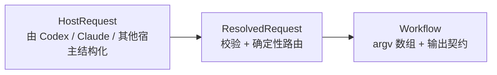
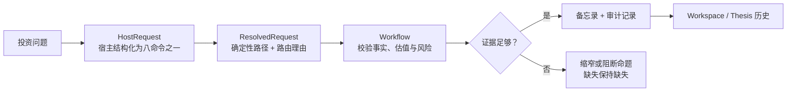
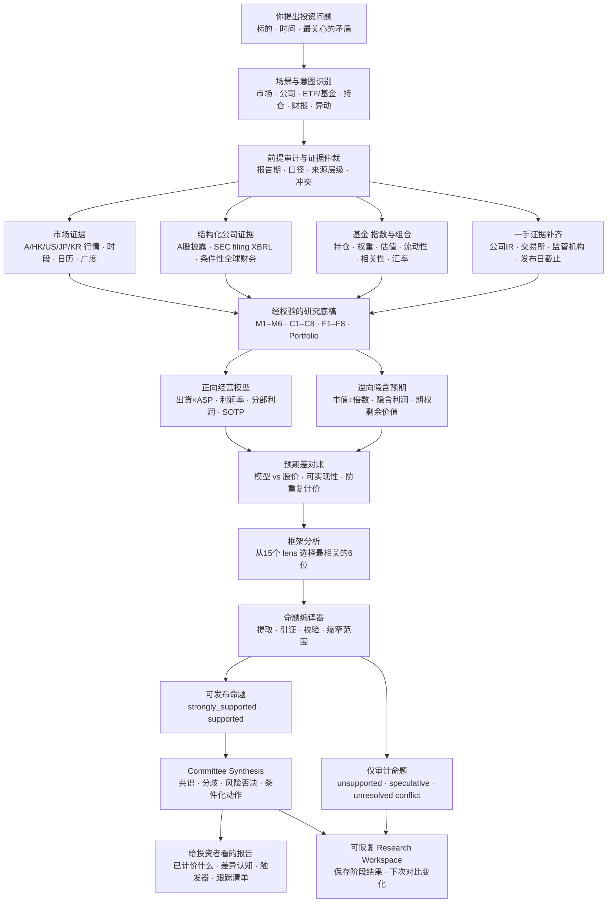
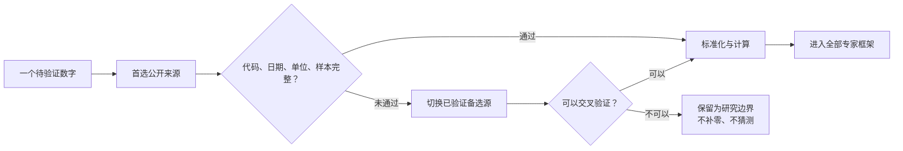
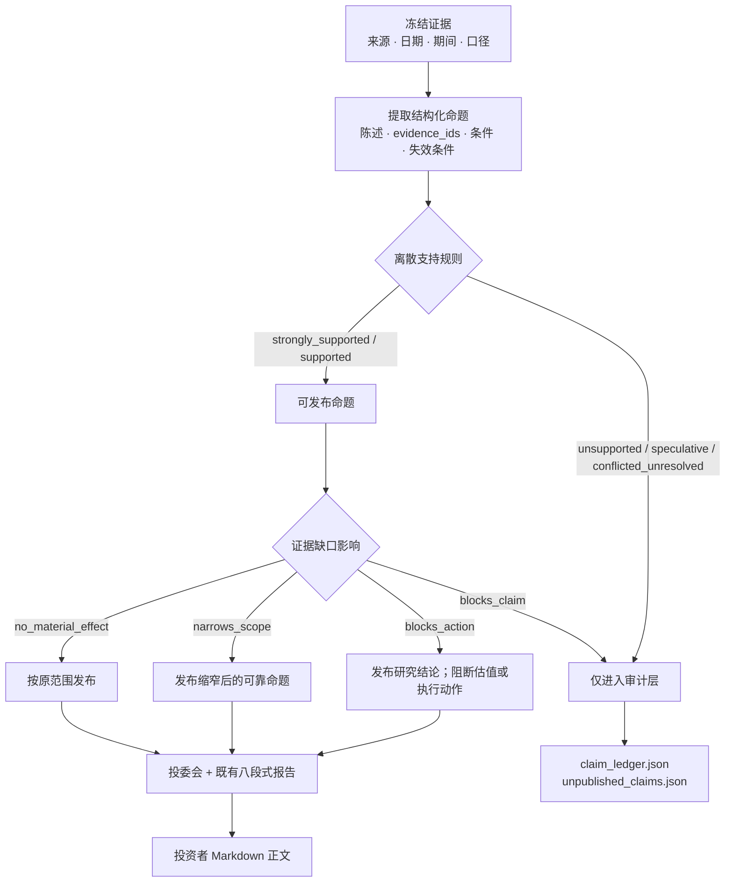

# stock-analysis

<div align="center">
  <a href="./README.md">English</a> |
  <a href="./README.zh-CN.md">简体中文</a>
</div>

<p align="center">
  <a href="https://github.com/AdvancingTitans/stock-analysis/releases/tag/v4.17.0"></a>
  <a href="https://pypi.org/project/stock-analysis/"></a>
  <a href="https://github.com/AdvancingTitans/stock-analysis/actions/workflows/ci.yml"></a>
  <a href="https://www.python.org/"></a>
  <a href="LICENSE"></a>
</p>

<p align="center">
  
</p>

<p align="center">
  <strong>面向 Agent 与投资者的证据优先投研系统。</strong>
</p>

<p align="center">
  核验前提 · 建模经营 · 逆向拆价 · 只发布证据支持的命题
</p>

<p align="center">
  <a href="https://github.com/thuquant/awesome-quant"></a>
  <a href="https://github.com/leoncuhk/awesome-quant-ai"></a>
  <a href="https://github.com/wangzhe3224/awesome-systematic-trading"></a>
  <a href="https://github.com/0xNyk/awesome-hermes-agent"></a>
</p>

<p align="center">
  A 股 / 港股 / 美股 / 日股 / 韩股 · ETF / 基金 · 组合 · 一手披露 · 正逆向估值 · 动态投委会
</p>

<p align="center">
  社区收录：<a href="https://github.com/thuquant/awesome-quant/pull/48">awesome-quant #48</a> ·
  <a href="https://github.com/leoncuhk/awesome-quant-ai/pull/39">awesome-quant-ai #39</a> ·
  <a href="https://github.com/wangzhe3224/awesome-systematic-trading/pull/124">awesome-systematic-trading #124</a> ·
  <a href="https://github.com/0xNyk/awesome-hermes-agent/pull/232">awesome-hermes-agent #232</a>
</p>

如果你经常有这些疑问：

- 贵州茅台跌到这个位置，究竟是估值机会，还是增长逻辑正在变化？
- 半导体 ETF 一年涨了很多，现在买入承担的是产业机会，还是高估值与拥挤交易？
- 财报发布后，利润、现金流、分红和资本配置到底发生了什么？
- 我的持仓看起来有十只股票，实际是不是都押在同一个风格上？

`stock-analysis` 是给投资者使用的开源投研操作系统，不是“AI 选股器”。它把一句自然语言问题变成可重复的证据流程：核验前提、处理冲突来源、建立经营模型、逆向拆解股价、暴露风险，并保存“这次和上次有什么变化”。最终交付是带证据边界和复查触发器的研究备忘录，不是一句“买入/卖出”。

## 一分钟看懂这个产品

| 投资者的问题 | 系统会核对什么 | 最终得到什么 |
|---|---|---|
| 今天市场发生了什么？ | 交易时段、指数、涨跌家数、板块轮动、流动性和缺失数据 | 先讲事实的市场复盘，以及下一交易日观察清单 |
| 这只股票或 ETF 值得深入研究吗？ | 行情、财报、盈利质量、估值、指数暴露、回撤和交易成本 | 一份明确区分“已支持、存在分歧、仍然未知”的研究备忘录 |
| 财报或大涨大跌改变投资逻辑了吗？ | 可比报告期、公开事件、市场共同因素和因果证据 | 把“已确认触发、可能相关、市场因素、无依据猜测、未知”分开的变化复核 |
| 我的组合是不是看似分散、实际押注同一风险？ | 持仓完整性、集中度、相关性、币种、基准和流动性 | 持仓缺失、过期或不完整时自动收窄结论的组合复核 |
| 原来的投资论点被证伪了吗？ | 当前冻结证据与历史不可变版本 | 带完整审计链的复核、比较、更新或失效记录 |

产品坚持三个承诺：

1. **缺失就是缺失。** 不把空数据补成 `0`、评分或自信结论。
2. **同样的请求走同样的路径。** Agent 宿主负责结构化，Python 负责确定性决策。
3. **每个结论都保留边界。** 日期、来源、证据缺口、路由原因和保存产物都可以回查。

### 按你的使用方式开始

| 你是… | 从这里开始 | 你会得到什么 |
|---|---|---|
| 使用 Agent 的投资者 | [安装 Agent 入口](#agent-安装)，然后直接用自然语言提问 | Agent 选择对应的确定性流程，并解释可核验结果 |
| CLI 用户 | `uv tool install stock-analysis` | 无需 LLM，即可用稳定命令生成可复现的 Markdown 与 JSON |
| 研究员或复核者 | `stock-analysis --market research --symbol <代码>` | 可恢复 Workspace、冻结证据、命题台账、投委会复核和最终报告 |
| 贡献者 | [开发](#开发) | 测试、Schema、统一 Agent 契约，以及可扩展的数据源与 lens 边界 |

不懂 Python 也可以使用。安装 Skill 后，在 Codex 或 Claude Code 里直接说中文即可：

```text
深度分析半导体ETF 512480。重点回答当前估值是否透支景气，
标的指数最近一年的趋势和回撤如何，100万元买卖一次大约承担多少交易成本。
请自动选择最合适的6位专家组成投委会，并输出最终研究报告。
```

你也可以使用确定性 CLI：

```bash
uv tool install stock-analysis

stock-analysis --market daily
stock-analysis --market stock --symbol 600519
stock-analysis --market stock --symbol 7203.T
stock-analysis --market stock --symbol 005930.KS
stock-analysis --market screen --fiscal-year 2025 --universe-file official_universe.json --filter roe_weighted:gt:8% --sort roe_weighted:desc
stock-analysis --market research --symbol 512480 --asset-type fund
stock-analysis --market research --symbol 600519 --expectations-file examples/company-expectations.example.json
```

> 输出仅供研究参考，不构成投资建议。

## 72 秒看懂产品

<p align="center">
  <a href="promo/demo-video/out/stock-analysis-demo-zh-CN.mp4"></a>
  <a href="promo/demo-video/out/stock-analysis-demo-en.mp4"></a>
</p>

按你的语言习惯选择：[观看简体中文介绍](promo/demo-video/out/stock-analysis-demo-zh-CN.mp4)或 [Watch in English](promo/demo-video/out/stock-analysis-demo-en.mp4)。

两个介绍均为 1080p、72 秒，以字幕传递完整信息，静音也能观看。视频展示一个投资问题如何经过多市场证据、正逆向估值、命题校验和发布门控，最终成为投委会备忘录。视频对应 v4.16 研究引擎；v4.17 新增的宿主协议与确定性路由已展示在下方新版动态架构图中。可编辑的 Remotion 工程位于 [`promo/demo-video`](promo/demo-video/)。

## 按目标阅读 README

- [选择正确的研究入口](#从投资问题开始)
- [理解系统架构](#系统如何工作)
- [为 Agent 或终端安装](#agent-安装)
- [复制可用的提示词](#安装后推荐这样提问)
- [运行 CLI](#快速开始)
- [审计证据与命题契约](#证据模块)

## 为什么需要它

很多 AI 投资工具的起点是“让几个 Agent 讨论一下”，终点是一段很流畅的观点。真正让投资者难受的却是中间缺失的部分：数字属于哪个报告期？基金买的究竟是什么指数？网页披露的 tracking error 能否复算？买入 100 万元后，价差和冲击会吃掉多少收益？

`stock-analysis` 的顺序是：**先审计前提，再建立证据，正向建模、逆向验价，最后形成观点。**

| 常见方案 | 更擅长什么 | stock-analysis 的不同选择 |
|---|---|---|
| 通用聊天机器人 | 快速解释概念、生成流畅文字 | 先运行确定性数据流程；日期、来源和缺失项必须过校验后才能进入报告 |
| [OpenBB](https://github.com/OpenBB-finance/OpenBB) 一类数据平台 | 广泛的数据接入和研究接口 | 更专注中国投资者拿来即用的研究场景、中文报告和 Agent 提示词 |
| [TradingAgents](https://github.com/TauricResearch/TradingAgents)、[ai-hedge-fund](https://github.com/virattt/ai-hedge-fund) 一类多 Agent 框架 | 角色协作、交易研究实验 | 委员不是固定阵容；系统根据问题从 15 个框架中选择 6 位，并要求每位委员读取同一批结构化指标 |
| [FinGPT](https://github.com/AI4Finance-Foundation/FinGPT) 一类金融模型项目 | 金融语言模型、情绪和训练研究 | 不要求训练模型；重点是一手披露、市场数据、基金指数和可恢复的研究流程 |

项目目前尤其重视这些容易被普通研报忽略的细节：

- 公司研究读取结构化财务、官方年报 PDF、治理与资本配置事实；净利率和经营现金转化会进入每位委员的框架。
- 公司估值同时走两个方向：产品线收入与 SOTP 构成正向模型；当前市值再按明确倍数反推隐含利润，并与正向模型逐项对账。
- 核心盈利和期权价值分开。内部组件不能同时计入多个分部；SOTP 分部价值超过市值时，负剩余价值会原样报告，不会被静默归零。
- ETF 研究不只看基金净值和前十大持仓，还读取官方指数样本、权重、估值和日线，重算相关系数、beta、tracking error、回撤与波动。
- 股票与 ETF 使用同一套订单成本情景，区分价差、佣金、经手费、过户费、适用印花税和市场冲击。
- 同一标的下次再研究时，可以保留上次结果并观察“什么发生了变化”。

如果数据源失败，缺失指标保持缺失，不会用 `0` 回填，也不会把单日涨跌包装成基本面结论。

## 从投资问题开始

先选择你遇到的投资问题，而不是拼凑底层参数。每个场景先生成确定性证据（可回查的价格、已披露财务或公开事件）；Agent 可以解释证据，但不能绕过来源、交易日和完整性校验。

| 你现在要解决的问题 | 什么时候用 | 场景入口 | 确定性 CLI |
|---|---|---|---|
| 今天市场发生了什么 | 开盘前、盘中或收盘后想先掌握市场背景 | `/market` | `--market daily` |
| 核对一个标的的事实 | 只想看现价、近期涨跌、成交和已披露财务，不想要观点 | `/snapshot` | `--market stock --symbol` |
| 一个标的是否值得深度研究 | 准备建仓、继续持有，或需要可恢复的完整研究流程 | `/analyze` | `--market research --symbol` |
| 财报出来后，哪些数字真的变了 | 已发布季报/年报后，按可比口径复核公开披露事实 | `/earnings` | `--market earnings --symbol` |
| 一只股票突然涨跌，先发生了什么 | 想区分价格、成交和公开事件，避免把新闻直接当原因 | `/move` | `--market price-move --symbol` |
| 找出满足明确财务条件的 A 股 | 已有 ROE、营收增速等硬条件，且希望结果可重复 | `/screen` | `--market screen …` |
| 我的持仓是否押在同一个风险上 | 已有完整持仓，想检查因子、币种、集中度与流动性 | `/portfolio` | `--market portfolio` |
| 留下并复查自己的投资理由 | 想创建、复核、比较、更新或判定论点失效，同时保留历史 | `/thesis` | `--market thesis-* --symbol` |

Claude Code 原生支持 `/command` 入口。Codex 的 Custom Prompt 显示为 `/prompts:analyze`；安装生成的 Skill 后，Agent 可以根据 Skill 描述把“分析腾讯”这类自然语言请求匹配到相应 Skill，并执行其中的确定性命令。`/market-recap`、`/stock-review` 等旧名称只是临时兼容转发。意图识别发生在宿主 Agent，而非 `stock-analysis` Python 包内部。所有入口均从同一份 canonical catalog 生成，避免工作流漂移。

### Agent 命令协议 v2

v4.17 将八个名称固定为正式 Agent 入口：`/market`、`/snapshot`、`/analyze`、`/earnings`、`/move`、`/screen`、`/portfolio`、`/thesis`。`/market-recap`、`/stock-review` 等旧名称继续转发一至两个大版本；`/data-diagnose` 保持运维入口。

正式运行边界固定为：



宿主负责生成结构化 `HostRequest`；Python Router 只消费该对象，按显式参数和能力需求生成 `ResolvedRequest`，正式链路不解析自由文本。`--input` 仅供调试与测试 Fixture 使用。

```bash
# 安全安装生成的 Codex Skills + Prompts 与 Claude commands。
stock-analysis-agent install all
stock-analysis-agent doctor all

# 正式路由：传入一个结构化请求。
stock-analysis agent route --request '{"schema_version":"2.0","command":"analyze","arguments":{"asset":"600519"}}'
stock-analysis agent run --request request.json
```

每个生成文件都携带 catalog hash、命令 id 与 schema metadata。安装器使用 `${STOCK_ANALYSIS_HOME:-~/.stock-analysis}` 下的统一 manifest，不覆盖非托管文件，并提供 `dry-run`、`doctor` 和受保护的 `uninstall`。CI 会同时校验 canonical catalog、JSON Schema、宿主入口和 280 条双语/歧义/恶意路由 Fixture 是否漂移。

## 系统如何工作


新版动画展示 v4.17 的正式运行路径：宿主先把你的问题整理成八个命令之一，Python Router 不猜自然语言，只对结构化请求做确定性路由；随后工作流校验证据，输出门控保留所有缺失边界。



希望进一步核对研究引擎内部逻辑的读者，可以继续查看下方详细流程图。



对普通投资者来说，可以把它理解成四步：

1. 你用自然语言说清楚“研究谁”和“最想解决什么问题”。
2. 系统按场景寻找数据，并拒绝使用研究日期之后才披露的信息。
3. 从 15 个投资框架中挑选最匹配问题的 6 位组成投委会；不是每次都让同一批人发表模板化观点。
4. 公司和基金深度研究只有受支持命题进入委员会综合；未发布命题与覆盖缺口留在机器可读审计产物中。

核心边界是：**问题决定研究路径，代码负责取得和校验证据，投资框架只能解释已经存在的数据。** M1–M6 服务市场与组合；C1–C8 回答公司本身；F1–F8 回答基金合同、指数暴露、估值、跟踪与交易实现。



### 深度研究的可支持命题发布机制

v4.16 的发布层有明确作用范围：仅对公司和基金 `--market research` 默认启用。市场日报、`stock-review`、`earnings`、`price-move`、快照与持仓报告保持既有契约；需要说明缺失模块的流程仍会在正文自然说明。



系统不使用连续置信分。每个命题只能处于五个状态之一：`strongly_supported`、`supported`、`unsupported`、`speculative`、`conflicted_unresolved`。普通证据缺口只过滤或缩窄相关命题，不得被转化为看空、中性、保守、观望或等待信号。

| 完整性情形 | 发布结果 |
|---|---|
| 当前价格缺失 | 阻断当前估值与价格相关动作；保留已有经营研究 |
| 总市值缺失 | 阻断反向估值；保留已有基本面研究 |
| 流动性缺失 | 阻断交易执行计划；保留已有研究结论 |
| 身份、报告口径、一手来源冲突、前视偏差无法解决，或没有相关可发布命题 | 阻断整份深度研究报告 |

公开报告继续沿用公司和基金各自的八段式骨架，且永远不会自动推导仓位或输出无条件买卖指令。

## Agent 安装

### 不会编程：把这段话发给你的 Agent

在 Codex 或 Claude Code 中粘贴：

```text
请帮我安装 https://github.com/AdvancingTitans/stock-analysis：
1. 克隆仓库；
2. 用 uv 安装 stock-analysis；
3. 先运行 stock-analysis-agent dry-run all，再运行 stock-analysis-agent install all；
4. 运行 stock-analysis-agent doctor all，并检查 stock-analysis --version；
5. 不要改动我的其他项目文件，完成后告诉我可以直接使用的三个中文提示词。
```

Agent 完成后，你不需要记命令。直接说“深度分析 600519”“复盘今天 A 股”“分析我的持仓”即可。意图识别发生在宿主 Agent，`stock-analysis` 负责取得和校验数据。

### 熟悉终端：三步安装

```bash
git clone https://github.com/AdvancingTitans/stock-analysis.git
cd stock-analysis
uv tool install --force .
python3 scripts/sync_agent_entrypoints.py --check
stock-analysis-agent dry-run all
stock-analysis-agent install all
stock-analysis-agent doctor all
```

只使用 CLI 时，执行 `uv tool install stock-analysis` 即可。托管安装器会添加 Codex Skills + Prompts 与 Claude commands，用统一 manifest 记录文件，拒绝覆盖非托管内容，并支持受保护的 `uninstall`；不会修改已有持仓记忆。

## 安装后，推荐这样提问

好的提示词不需要写技术参数，只需要说清楚四件事：**标的、研究时点、核心问题、希望如何决策。**

### 1. 每日市场复盘

```text
复盘今天A股收盘。先判断指数、市场广度、板块轮动和风险偏好，
再结合我的持仓说明哪些方向跑赢或跑输基准，最后给出明天的观察清单。
不要把缺失数据写成0，也不要只复述新闻。
```

### 2. 个股深度研究

```text
深度分析贵州茅台600519。核心问题是当前19倍左右估值能否被未来三年的盈利、
现金流和股东回报支撑。请核对年报一手披露、净利率、经营现金转化、分红、
资本配置和交易成本，自动选择最合适的6位专家组成投委会。
```

### 3. ETF / 基金研究

```text
研究半导体ETF国联安512480。不要只看过去涨幅和前十大持仓，
请核对标的指数完整成分、权重、估值和日线，重算跟踪误差、回撤与波动，
并估算10万、100万、500万元订单的往返成本。最后说明适合怎样的组合角色。
```

### 4. 财报复核

```text
复核600519最新财报。把收入、利润、毛利率、ROE、经营现金流、自由现金流、
分红和资本开支与上一报告期对比。区分已披露事实、合理推断和仍需验证的经营问题。
```

### 5. 持仓诊断

```text
分析我的持仓：600519 100股，买入日期2026-06-01；512480 10万份，
买入日期2026-05-20。请检查行业、风格、市场和币种集中度，比较基准表现，
并分别给出继续持有、降低风险或等待验证所需要满足的条件。
```

### 6. 指定框架或让两种框架辩论

```text
用巴菲特模式分析腾讯，重点看商业质量、资本配置和长期现金流。
```

```text
用 adversarial 模式让巴菲特和芒格辩论腾讯：一方论证长期价值，
另一方专门寻找治理、估值和机会成本上的反证，最后由组合经理总结。
```

## 报告示例

以下代表性报告展示了确定性证据与投委会流程；v4.16 的命题发布契约以上方说明和 Workspace 审计产物为准。

| 场景 | 报告里真正解决的问题 | 示例 |
|---|---|---|
| 贵州茅台个股研究 | 年报一手披露、净利率、现金转化、分红与资本配置、估值敏感性、交易成本如何共同影响结论 | [600519 动态投委会深度报告](reports/final-validation-v412-r2/600519/20260717/07-institutional-report.md) |
| 半导体 ETF 研究 | 完整指数成分与估值、146个指数日线样本、严格对齐后的 tracking error、回撤、波动及订单成本 | [512480 动态投委会深度报告](reports/final-validation-v412-r2/512480/20260717/07-institutional-report.md) |
| 全球市场复盘 | 指数、广度、板块、风险、持仓与下一交易日观察清单 | [投委会行情复盘](reports/20260709-投委会-行情复盘.md) |

<p align="center">
  
  
  
</p>

更多报告、截图、社交分享素材和自动化示例见 [reports/](reports/)。

## 你会得到什么

| 能力 | 含义 |
|---|---|
| 读得懂的中文投委会报告 | 先给执行摘要，再讲商业/指数逻辑、财务或持仓、估值、专家分歧、风险与条件化动作。 |
| 动态6人投委会 | 根据研究问题从15个框架中选择最匹配的6位，不再固定让同一组专家回答所有问题。 |
| 公司一手披露 | 通过可扩展规则读取官方年报 PDF，把经营、治理、分红和资本配置事实送入所有专家框架。 |
| 免费全球证据路由 | A/HK/US/JP/KR 免登录行情与日线；美股使用 SEC Company Facts；XTKS/XKRX 日历保留明确验证范围。 |
| 交易时段感知 | 盘前、集合竞价、盘中和盘后分别标记“尚未产生”“指示性”和“已完成”，不再把所有空字段都误判成数据源故障。 |
| 内置一手证据补齐 | 分部、渠道、治理、资本配置、风险和催化剂缺失时，生成面向公司、交易所和监管机构的定向请求；Agent Reach 是可选增强，不是用户前置依赖。 |
| 深度 ETF 研究 | 同时研究基金和标的指数，包含完整成分、权重、估值、指数日线、tracking error、折溢价和成本情景。 |
| A 股 / 港股 / 美股 / 日股 / 韩股 / 基金 / 持仓 | 一套入口覆盖市场复盘、单股、基金、财报、异动、筛选、持仓与投资论文。 |
| 多源校验与时间边界 | 优先使用稳定公开源；来源失败时自动降级；历史研究不会偷看未来披露。 |
| 可恢复研究工作区 | 分阶段保存研究计划、底稿、专家意见、委员会结论和最终报告，支持下次复查变化。 |
| 可支持命题发布 | 公司/基金深度研究只发布带引证与条件的命题；被拒命题和缺口保留在四个固定 JSON 审计产物中。 |
| 人机两用结果 | Markdown 给投资者阅读，JSON Evidence Pack 给 Agent 校验、自动化和复用。 |

## 快速开始

从 PyPI 安装：

```bash
uv tool install stock-analysis
stock-analysis --market daily
```

从本地仓库运行：

```bash
git clone https://github.com/AdvancingTitans/stock-analysis.git
cd stock-analysis
uv run stock-analysis --market daily
```

常用命令：

```bash
# 按北京时间市场阶段自动选择 summary/key-points/full
stock-analysis --market daily

# 带 JSON 证据的完整全球市场复盘
stock-analysis --market global --format full --emit-evidence

# 确定性的单股快照，不依赖 LLM
stock-analysis --market stock --symbol 600519

# 日本、韩国市场走同一套标准化行情链路
stock-analysis --market stock --symbol 7203.T
stock-analysis --market stock --symbol 005930.KS

# 想系统核对一家公司时使用：输出公司事实和明确缺口，不给综合买入分
stock-analysis --market stock-review --symbol 600519 --emit-evidence

# 财报发布后使用：仅复核已披露的结构化财务事实
stock-analysis --market earnings --symbol 600519 --emit-evidence

# 股价突然涨跌时使用：列出量价和公开事件，但不把相关性断言为因果
stock-analysis --market price-move --symbol 600519 --emit-evidence

# 建立并复查本地结构化投资论文快照
stock-analysis --market thesis-create --symbol 600519
stock-analysis --market thesis-review --symbol 600519
stock-analysis --market thesis-update --symbol 600519
stock-analysis --market thesis-compare --symbol 600519 --from-version 1 --to-version 2
stock-analysis --market thesis-invalidate --symbol 600519 --reason "核心假设已被一手证据否定"

# 创建或恢复分阶段机构研究工作区
stock-analysis --market research --symbol 600519
stock-analysis --market research --symbol 512480 --asset-type fund

# 带公开画像和持仓数据的基金快照
stock-analysis --market fund --symbol 161725

# 确定性 A 股年报选股；必须提供完整的官方 Security Master 快照
stock-analysis --market screen --fiscal-year 2025 --universe-file official_universe.json \
  --filter roe_weighted:gt:8% --filter revenue_growth_yoy:gt:8% \
  --sort roe_weighted:desc --limit 20 --emit-evidence

# 诊断 Tencent、Sina、Eastmoney、browser 和可选 mootdx 路由
stock-analysis --market diagnose
```

## 证据模块

### Company Evidence Pack（C1–C8）

把它理解为一份“继续研究前的事实清单”，不是选股器，也不是自动给出买卖答案。

**什么时候触发？** 当你准备回答“我是否要继续研究/持有这家公司？”时，运行 `/stock-review` 或 `stock-analysis --market stock-review --symbol <代码>`。它不会因你输入一个代码就自动创建持仓、保存投资理由或给出综合评分；只有你明确运行 `thesis-create` 时，才会在本地保存一份论文快照。

**它会给你什么？** 报告逐项列出已经核验到的事实、还没有公开或尚未接入的数据，以及下一步该补什么。例如：财务质量和估值数据可用时会列出对应期间和来源；护城河、管理层与资本配置没有足够可观察资料时，会直接写“证据暂缺”，而不是用“优质公司”之类的主观判断代替。

| 模块 | 用投资者语言回答的问题 | 当前会优先核对的内容 |
|---|---|---|
| C1 商业质量 | 它靠什么赚钱？ | 报价、市场和可获得的业务事实；业务拆分不足会保留缺口。 |
| C2 财务质量 | 赚的钱和现金流是否有公开证据支持？ | 已披露营收、利润率、ROE、负债、经营现金流、自由现金流等。 |
| C3 增长质量 | 增长是否能从已披露数字中看出来？ | 收入和利润等结构化历史数据；无法拆解的增长来源不猜测。 |
| C4 护城河证据 | 定价权、客户黏性或成本优势有数据支持吗？ | 只采用可观察证据；没有资料就明确缺失。 |
| C5 管理层与资本配置 | 回购、分红、并购、稀释或治理事件是否可核对？ | 已接入的公开事件；未覆盖时不作管理层评价。 |
| C6 估值与安全边际 | 经营模型能做到什么，市场已经计价什么？ | 静态估值、产品线/SOTP 假设、市值隐含利润、预期差对账与期权剩余价值。 |
| C7 风险与反证 | 哪些事实会削弱原先的判断？ | 量价异常、已披露风险及证据缺口。 |
| C8 催化剂与论文跟踪 | 什么证据会改变观点，何时可以验证？ | 新闻/事件，以及结构化指标、基准、下次检查日期和观点变化条件。 |

**最简单的用法：** 先运行一次 `stock-review`，阅读“可用模块”和“缺失模块”；若你只是想确认今天价格和近期表现，用 `stock-snapshot` 即可；若财报刚发布，优先用 `earnings-review`；若价格突变，优先用 `price-move`。这是四个不同的问题，不能互相替代。

公司研究和每日市场复盘使用不同的数据边界。`company_evidence_<symbol>_<date>.json` 保存 C1–C8 的可验证事实和缺口。美股优先使用免费免登录 SEC Company Facts，并严格按 filing date 截止；港股 Yahoo 三表只作为 conditional 二手证据。日股必须使用 `.T`，韩股使用 `.KS` / `.KQ`；内置 XTKS/XKRX 日历快照覆盖 2024–2027，范围外不会退化为工作日猜测。任一市场缺少经营、分部、治理、资本配置、风险或催化剂一手证据时，`_meta.primary_evidence_requests` 会驱动随安装包提供的 `primary-evidence-reach` Skill 查找公司、交易所和监管机构原文，再通过 `--primary-evidence-file` 回填；已有 Agent Reach 就使用其路由，否则使用宿主网页/PDF 能力，不要求用户另装 Agent Reach。

A/HK/US/JP/KR 日线现在统一输出本币 20 日平均成交额和 60 日波动率；完整持仓且样本对齐时，组合证据会生成两两相关性以及“本地价格收益/汇率收益/人民币收益”的逐日归因。实时组合估值不再用硬编码汇率兜底。历史订单簿、券商个性化佣金、基金真实净申赎仍保持显式缺口。

### Fund Evidence Pack（F1–F8）

基金研究同时核对场内产品与它实际持有的底层资产。模块名称在 Workspace 与命题台账中保持稳定。

| 模块 | 用投资者语言回答的问题 | 证据重点 |
|---|---|---|
| F1 产品定位与指数契约 | 基金必须跟踪什么，遵守哪些规则？ | 基金画像、标的指数、复制方式、样本与调仓规则 |
| F2 成分暴露与集中度 | 组合实际持有什么？ | 完整指数样本或已披露持仓、权重、前五/前十大集中度 |
| F3 业绩与趋势 | 产品过去实现了什么？ | 带明确期间的场内价格与基金画像收益 |
| F4 跟踪、折溢价与交易实现 | 场内价格能否有效跟随净值和指数？ | 折溢价、逐日对齐跟踪指标、交易实现证据 |
| F5 底层估值 | 指数或已覆盖持仓对应什么估值？ | 优先官方指数估值；持仓代理值必须标记为 conditional |
| F6 风险预算与回撤代理 | 暴露有多大波动和集中风险？ | 回撤、波动、beta、历史样本量与集中度代理 |
| F7 治理、规模与运营 | 产品能否按预期持有和交易？ | 费率、规模、基金经理、申赎状态、流动性与成本情景 |
| F8 催化剂与跟踪条件 | 哪个可观察事件会改变判断？ | 调仓、披露刷新、指标、日期、成立条件与失效条件 |

### 正向搭模型 + 逆向验市值

需要产品线、SOTP 或期权估值时，传入一份明确的 JSON 假设：

```bash
stock-analysis --market research --symbol 600519 \
  --expectations-file examples/company-expectations.example.json
```

确定性引擎先计算“出货量 × ASP → 收入 → 净利润 → 分部价值”，再独立计算“当前市值 ÷ 估值倍数 → 市场隐含净利润”。报告会展示每档倍数下的预期差、SOTP 剩余价值，以及期权业务需要实现多少收入和利润才能解释剩余市值。假设始终标为假设；尚未验证的用户前提不会被升级为公司事实。完整字段见[示例文件](examples/company-expectations.example.json)。

防重复计价是硬约束：写入 `includes_product_lines` 的产品线只能属于一个分部，避免内部配套组件既抬升模块利润率、又被当作独立外售业务估值。如果分部价值之和超过市值，剩余价值会保持为负并标记 `overallocated`，不会静默归零。

### 可恢复 Research Workspace

`stock-analysis --market research --symbol <代码>` 会在 `~/.stock_analysis/research/<symbol>/<trade_date>/` 下实体化机构化研究流程（可用 `STOCK_ANALYSIS_RESEARCH_DIR` 或 `--workspace-dir` 覆盖）。股票研究冻结 C1–C8 Company Evidence；基金研究使用 `--asset-type fund`（或由 auto 识别常见场内基金前缀），冻结独立的 F1–F8 Fund Evidence，覆盖产品契约、持仓集中度、业绩、跟踪与折溢价、底层估值缺口、风险、治理和跟踪条件。所有 lens 与 committee 必须消费同一内容寻址快照。同一日期重复运行会保护人工修改，并把新结果写到 `.generated` 文件。

```text
~/.stock_analysis/research/<symbol>/<trade_date>/
├── 01-research-plan.md
├── 02-frozen-company-evidence.json  # 或 02-frozen-fund-evidence.json
├── 03-evidence-summary.md
├── 04-*-lens-opinions.json
├── 05-committee-synthesis.json
├── 06-decision-memo.md
├── 07-institutional-report.md
├── evidence_manifest.json
├── claim_ledger.json
├── coverage_report.json
├── unpublished_claims.json
└── workspace.json
```

Company opinions 是确定性的框架复核，不是模拟专家发言：所有支持与反证都必须引用同一个冻结 `snapshot_id` 中的 `evidence_id`。committee 会拒绝混用不同快照，并且只消费与研究问题相关的可发布命题。`publication_status` 为 `publish`、`block_action` 或 `block_report`；工作流 action 在报告完整性需要阻断前保持 `manual_review`，不会自动推导仓位或交易动作。现有源补充了结构化财报/预告/快报、PE/PB/市值、融资现金流，以及治理/资本配置公告索引；聚合记录在回查公司或交易所原文前仍保持 secondary。

每个财务事实都会记录期间、币种、会计范围、来源类型、来源和置信度，方便你回查数字来自哪里。[`config/metric_registry.json`](config/metric_registry.json) 规定指标如何校验、可被哪些框架使用；它不会输出综合“买入评分”。

启用 `--emit-evidence` 后，CLI 会写出：

```text
evidence_YYYYMMDD.json
m1_YYYYMMDD.json
m2_YYYYMMDD.json
m3_YYYYMMDD.json
m4_YYYYMMDD.json
m5_YYYYMMDD.json
m6_YYYYMMDD.json
```

六模块评分关注的是报告可信度，不是收益宣传：

| 模块 | 关注点 | 权重 |
|---|---:|---:|
| M1 | 跨市场指数状态、广度、流动性、基准背景 | 20 |
| M2 | 行业和概念轮动 | 20 |
| M3 | 短线情绪和涨停结构 | 20 |
| M4 | 风险、突破失败、下行压力 | 15 |
| M5 | 持仓暴露、风格、集中度、持仓脉冲 | 15 |
| M6 | 韧性方向和下一交易日观察清单 | 10 |

即使质量评分偏低，完整报告也会保持相同结构；缺失模块会在相关章节自然说明。

当前交易日的 A 股全市场广度，优先要求东财 `clist` 的每一页、服务端总数和有效行数全部对账；若连接失败，Sina `hs_a` 必须分页至空页/短页，并核对唯一代码和有效行数。历史日期保留“不可用”，不会把行业板块成分汇总冒充全市场。Tencent 日 K 线样本齐全时，Evidence 还会提供 5d/20d/60d 收益、成交量 z-score 与 ATR。

## 为 Agent 而设计

Agent 入口是一份公开协议，而不是藏在 Python 里的自由文本猜测器：

- 八个正式命令覆盖市场、速览、深度分析、财报、异动、筛选、组合和投资论点。
- Codex、Claude 等宿主生成 `HostRequest`；Python 只返回确定性的 `ResolvedRequest` 与 Workflow。
- `--input` 仅供调试和测试 Fixture，绝不进入正式链路。
- catalog hash、路由理由、argv、输出契约、日期、来源和 fallback 事件均可机器审计。
- Markdown 给投资者阅读，JSON 供宿主、cron、notebook 与下游自动化使用。

示例 Agent prompt：

```text
请用 /analyze 深度研究 600519，研究时点为最近一个已完成交易日。
重点检验当前价格能否被盈利质量、现金转化、股东回报和逆向估值支持。
缺失证据必须保持缺失，保留路由元数据，并给我投资者备忘录与审计产物路径。
```

日常 Agent 工作流见 [examples/agent.md](examples/agent.md)，定时生成报告并上传 Evidence Pack 的 GitHub Actions 示例见 [examples/github-actions-daily-recap.yml](examples/github-actions-daily-recap.yml)。

## 它不是什么

- 不是交易机器人。
- 不是券商接口。
- 不承诺覆盖所有市场数据。
- 不能替代专业投资建议。
- 不是黑箱 LLM 报告生成器。

## 数据源策略

| 场景 | 主路径 | 降级路径 |
|---|---|---|
| A 股行情和估值 | Tencent → Sina | Eastmoney `stock/get` |
| A 股指数 | Tencent → Sina | Eastmoney index endpoints |
| 板块排行 | Eastmoney `clist` | Tonghuashun public pages → browser fallback |
| 港股行情 | Tencent/Sina | Eastmoney `stock/get` |
| 美股行情 | Sina/Tencent | Eastmoney `searchapi` → `stock/get` |
| 日股/韩股行情与日线 | Yahoo chart；韩国由 Naver 交叉核对 | 代码或日历校验失败时保留显式缺失 |
| 美股已申报财务 | SEC Company Facts，按 filing date 截止 | 通过范围与时点校验后的条件性全球三表 |
| 公司一手证据 | 公司 IR → 交易所 → 监管机构 | 定向一手证据请求；无法解决的缺口继续保留 |
| 中证指数成分与估值 | 中证指数官方文件 | 带条件覆盖标签的基金披露持仓 |
| 组合估值汇率 | 实时公开 FX 路由 | 不使用硬编码实时汇率兜底 |
| 基金 | Eastmoney/Tiantian fund pages | Sina fund fallback |
| 深度 tick / order-book 数据 | Optional `mootdx` | Basic Tencent/Sina quotes |

Yahoo 不是 A/HK/US 行情的默认路径；仅用于文档明确列出的日/韩历史行情与全球财务条件路径，并执行代码、日期、口径和完整性校验。

## 投资者 Lens

Lens engine 可以把同一份 evidence 按不同投资框架组织成报告。当前支持：

`buffett`, `munger`, `graham`, `klarman`, `lynch`, `o_neil`, `wood`, `dalio`, `soros`, `livermore`, `minervini`, `simons`, `duan_yongping`, `zhang_kun`, `feng_liu`.

Lens 会改变证据优先级和叙事结构，但不会绕过数据质量规则，也不会编造缺失数字。

### 内置 lens 与 committee 边界

当前 CLI 版本为 `4.17.0`。

`research` 报告保留 4.5 系列的中文投委会分析密度，并把可恢复、可追溯的研究状态留在 Workspace 内部。个股沿用“执行摘要 → 行情与商业质量 → 财务增长 → 治理与资本配置 → 估值情景 → 投委会审议 → 风险催化 → 条件化动作”；基金沿用“执行摘要 → 产品与指数契约 → 持仓暴露 → 业绩风险 → 估值与交易实现 → 投委会审议 → 风险催化 → 条件化动作”。每位 lens 把结果隔离为 `publishable_claims` 和 `unpublished_questions`，committee 只消费前者。普通证据缺失只过滤或缩窄相关命题，不得被解释成看空、中性、保守、观望或等待信号。

每个发布命题必须引用冻结快照内的 `evidence_id`，并带有适用期、条件和失效条件。`unsupported`、`speculative`、`conflicted_unresolved` 命题不进入投资者正文，只保留在 `evidence_manifest.json`、`claim_ledger.json`、`coverage_report.json` 和 `unpublished_claims.json`。价格、总市值或流动性缺失只阻断估值或执行行动，不压低已有经营结论；身份、口径完整性、一手冲突、前视偏差或完全没有可发布命题时阻断整份报告。

LensEngine 是报告生成的核心编排器。`research` 默认使用 committee 模式，并根据用户问题从 15 个内置 lens 中选择最相关且互补的 6 位委员；用户显式指定专家时尊重用户选择。每位委员都会读取同一研究时点的全部结构化指标，再按自己的投资框架解释。自然语言调用也可表达为“用巴菲特模式分析贵州茅台”或“用 adversarial 模式让巴菲特和芒格辩论腾讯”；committee 失败时降级为 single，并在内部 metadata 保留原因。

Company 一手披露采用可扩展的“官方 PDF → 指定页文本 → JSON 正则规则 → C1–C8”适配器。600519 的经营、渠道、分红、回购、审计意见与产能数据已从年报原文实时抽取；新增发行人只需增加规则目录，不再修改报告生成代码或硬编码数值。

512480 通过中证指数官方文件读取 H30184 的完整样本、月末权重、每日指数估值和标的指数日线。ETF 与指数按交易日严格对齐后重算相关系数、beta、tracking error 和主动收益。股票、基金与组合持仓共用同一成本情景模型，覆盖价差、佣金、经手/过户费、适用印花税、20 日成交额参与率和波动率冲击。

`committee` 报告有固定骨架：执行摘要 → 大盘指数概览 → 持仓分析（有完整持仓时）→ 六模块深度复盘 → 综合持仓建议与风险提示。结尾建议需要覆盖现状总结、基准跑赢/跑输、条件化仓位动作、下一交易日观察清单和风险提示。证据附录不进入早盘、盘中、午间或盘后正文；如果 M1-M6 某个模块缺失，相关章节必须说明证据暂缺。

`--market stock --symbol <code>` 和 `--market fund --symbol <code>` 是确定性证据视图，不要求用户安装任何外部行情 CLI。浏览器路径只作为 API 连续失败或页面独有数据的降级路径；工程细节进入 evidence/diagnose，不进入正文。

北向资金只有在当前交易日的序列覆盖至 14:50 后、分钟样本充足且开盘基线合理时才展示绝对值；历史或半截序列保持不可用。基金画像按每只基金、每个字段核验，因此 ETF 未返回费率时不会被当作可比费率。板块榜同时记录来源 taxonomy，未经归一不能把不同提供方的分类直接横向比较。

场内基金折溢价使用腾讯前复权日 K 线和天天基金官方历史净值分页逐日对齐；公开份额拆分会先归一，无法解析的公司行为则不生成序列。基金页面的年化跟踪误差只作为披露元数据展示，不冒充本工具按日重算的 tracking error。

基金画像通过天天基金公开评估页 `pingzhongdata` 补充长期业绩、前端费率、规模和基金经理画像；该路径不依赖登录或 API key。基金速览应展示长期业绩、前端费率、基金经理信息和已披露缺口。

投资记忆默认路径为 `~/.stock_analysis/profile.json`，也可以用 `STOCK_ANALYSIS_PROFILE` 覆盖。完整持仓必须同时具备股票代码、买入日期、买入数量或买入金额。若用户新提供的信息与之前保存的投资记忆不一致，确认信息完整性后，优先以用户新提供的信息为准，并覆盖写入投资记忆。

当用户明确提出想用哪位投资专家的风格时，整篇报告都必须完全以相关专家的视角输出报告，不得只在结尾追加专家点评。单专家视角和多专家综合的结构不同，但都不得模仿身份声明或虚构专家发言。

## 贡献

适合上手的贡献方向：

- 新增或加固公开数据源 adapter。
- 改进报告模板或投资者 lens。
- 为新的地区、标的类型或 Agent 工作流补充示例。
- 带着 `--market diagnose` 输出报告数据源失效。
- 把项目提交到匹配度高的 Awesome List 或 Agent 工具目录。

请先阅读 [CONTRIBUTING.md](CONTRIBUTING.md) 和 [ROADMAP.md](ROADMAP.md)。

## Future Roadmap

v4.17 明确只做到 P1，保持本次版本聚焦“命令协议 + 多宿主兼容 + 确定性路由”。Hermes 专用 adapter、宿主侧 Web/PDF 增强、默认关闭的 opt-in 匿名遥测，以及基于真实失败样本的路由优化，四项整体移至后续版本。详见 [ROADMAP.md](ROADMAP.md)。

## Awesome List 简介

提交到精选列表时，可以使用这句简介：

> [stock-analysis](https://github.com/AdvancingTitans/stock-analysis) - Evidence-first research CLI and Agent workflow for A/HK/US/JP/KR stocks, funds, and portfolios, with primary disclosures, forward/reverse valuation, recoverable Workspaces, supported-claim publication, and auditable JSON evidence contracts.

适合目标包括 `awesome-quant-ai`、`awesome-ai-in-finance`、`awesome-quant` 和 `awesome-systematic-trading`。

## 开发

```bash
uv sync
uv run --with pytest pytest -q
uv run --with ruff ruff check
```

## License

MIT

以上内容仅供研究参考，不构成任何投资建议。股市有风险，投资需谨慎。
