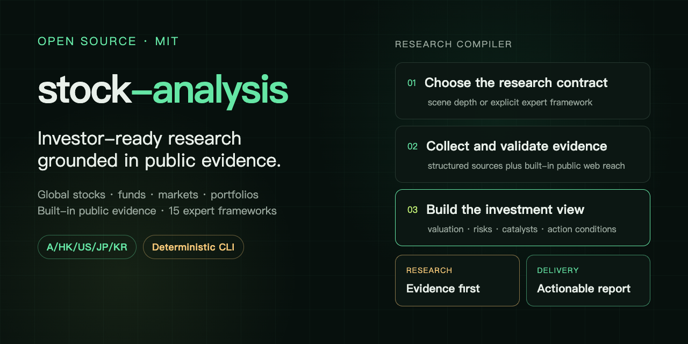
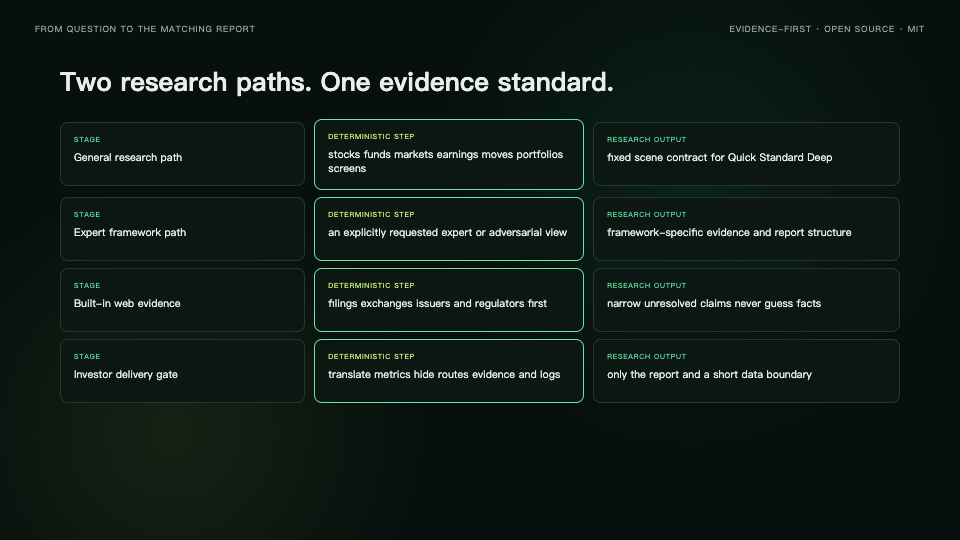
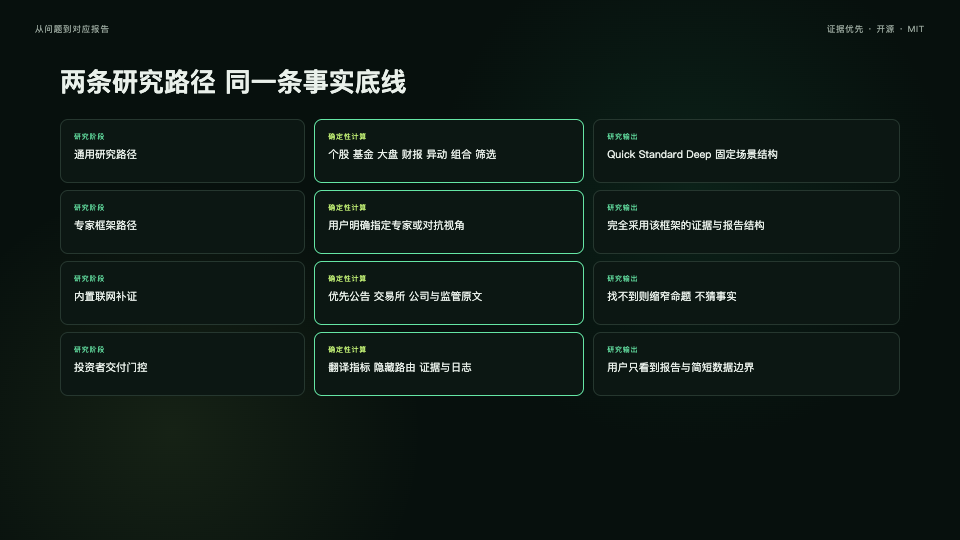
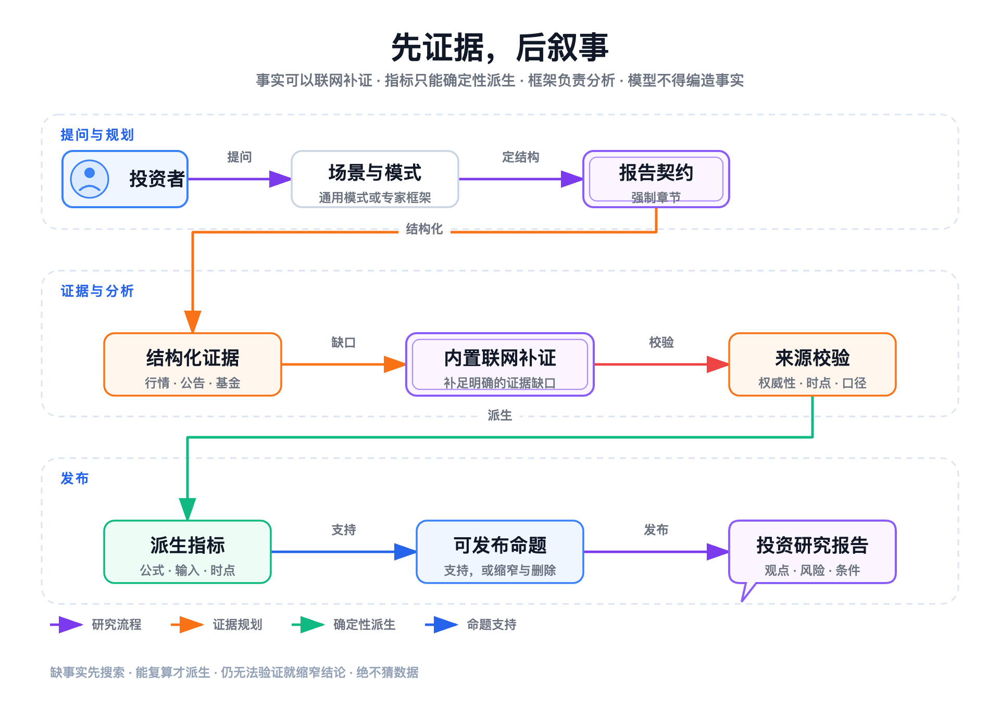
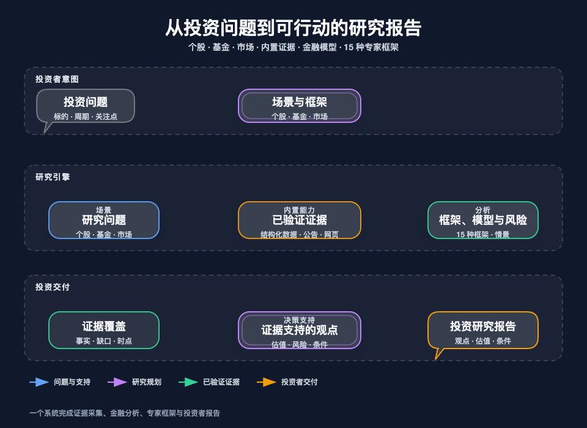

# stock-analysis

<div align="center">
  <a href="./README.md">English</a> |
  <a href="./README.zh-CN.md">简体中文</a>
</div>

<p align="center">
  <a href="https://github.com/AdvancingTitans/stock-analysis/releases/tag/v5.0.0"></a>
  <a href="https://pypi.org/project/stock-analysis/"></a>
  <a href="https://github.com/AdvancingTitans/stock-analysis/actions/workflows/ci.yml"></a>
  <a href="https://www.python.org/"></a>
  <a href="LICENSE"></a>
</p>

<p align="center">
  
</p>

<p align="center">
  <strong>输入一个投资问题，直接得到一篇投资者可用的专业报告。</strong>
</p>

<p align="center">
  个股 · 基金与 ETF · 大盘 · 财报 · 异动 · 筛选 · 组合 · 投资论文
</p>

<p align="center">
  <a href="https://github.com/thuquant/awesome-quant"></a>
  <a href="https://github.com/leoncuhk/awesome-quant-ai"></a>
  <a href="https://github.com/wangzhe3224/awesome-systematic-trading"></a>
  <a href="https://github.com/0xNyk/awesome-hermes-agent"></a>
</p>

当前 CLI 版本为 `5.0.0`

`stock-analysis` 是面向投资者的开源研究系统，不是 AI 选股器，也不执行自动交易。用户只需用自然语言提出问题，系统会识别研究场景、获取公开证据、校验来源与时点、派生可复算指标、调用合适的金融框架，并交付一篇专业报告。

它解决的不是“多生成一段行情摘要”，而是把投资者真正需要的完整研究链路放进一个产品：先明确问题，再获取与验证证据，随后用适合的金融框架分析，最后给出观点、估值、风险和行动条件。只有真实数据边界会改变结论时，才在报告正文之外用自然语言简短说明。

## 72 秒了解产品

<p align="center">
  <a href="promo/demo-video/out/stock-analysis-demo-en.mp4"></a>
  <a href="promo/demo-video/out/stock-analysis-demo-zh-CN.mp4"></a>
</p>

[观看英文版](promo/demo-video/out/stock-analysis-demo-en.mp4) · [观看简体中文版](promo/demo-video/out/stock-analysis-demo-zh-CN.mp4) · [编辑 Remotion 源码](promo/demo-video/)

## 投资者能得到什么

| 你的问题 | 系统完成的研究 | 默认交付 |
|---|---|---|
| “分析贵州茅台 600519” | 商业模式、竞争格局、财务质量、估值、催化剂、风险和行动条件 | 完整个股 Standard 报告 |
| “这只 ETF 适合当核心仓吗？” | 指数或策略、持仓、因子暴露、回撤、费用、流动性和组合角色 | 基金/ETF 报告 |
| “今天 A 股发生了什么？” | 指数、宽度、风格轮动、成交、驱动、情景和下一交易日信号 | 大盘报告 |
| “这次财报改变投资逻辑了吗？” | 可比期间、利润率、现金流、指引、预期差和估值影响 | 财报复核 |
| “为什么这只股票突然大涨？” | 事件时间线、已确认原因、高相关解释、市场结构和验证信号 | 异动分析 |
| “用巴菲特和索罗斯对抗分析” | 两套独立框架、分歧补证、冲突假设与未来胜负信号 | 对抗框架报告 |

## 安装

### Agent 用户

```bash
uv tool install stock-analysis
stock-analysis-agent install all
```

重启 Agent 宿主后，直接用自然语言：

```text
分析贵州茅台 600519。
深度研究宁德时代 300750，加入同业和情景分析。
分析半导体 ETF 512480 是否适合作为卫星仓。
用巴菲特框架分析贵州茅台。
用巴菲特和索罗斯对抗分析贵州茅台。
复盘今天的 A 股市场。
```

意图识别发生在宿主 Agent。安装器管理 Codex 与 Claude Code 入口；仓库同时分发通用 Skill 产物，供其他宿主按自身机制加载。`stock-analysis-agent doctor all` 检查安装状态；`stock-analysis-agent uninstall all` 只移除本项目管理的文件。

### CLI 用户

```bash
uv tool install stock-analysis

stock-analysis --market stock --symbol 600519
stock-analysis --market fund --symbol 512480
stock-analysis --market research --symbol 600519 --asset-type company --depth standard
stock-analysis --market research --symbol 512480 --asset-type fund --depth deep
stock-analysis --market a --depth standard
stock-analysis --market earnings --symbol 600519 --depth standard
stock-analysis --market price-move --symbol 300750 --depth standard
```

完整确定性参数请运行 `stock-analysis --help`。

## 两条研究路径

### 通用研究：Quick、Standard、Deep

用户没有指定专家框架时，系统按场景加载固定的投资者报告契约：

| 模式 | 解决的问题 | 研究权限 |
|---|---|---|
| Quick | “现在大概怎么看？” | 核心事实、估值或价格锚、主要风险、后续信号 |
| Standard | 默认完整研究 | 场景完整报告、比较、估值、催化剂、风险和条件式行动 |
| Deep | 重大决策支持 | 跨来源核验、多期和同业、多个估值方法、情景与反方审查 |

Quick 不是 Standard 的机械截断，Deep 也不是 Standard 的机械扩写。每个场景和深度都有确定性章节契约。项目目前提供 7 类场景、21 份报告契约：

- 个股；
- 基金和 ETF；
- 大盘；
- 财报；
- 异动；
- 组合；
- 筛选。

典型结构：

- 个股 Standard：投资结论 → 商业模式 → 核心逻辑 → 竞争格局 → 财务质量 → 估值 → 催化剂 → 风险 → 行动框架。
- 基金 Standard：组合角色 → 产品策略 → 收益来源 → 风险 → 持仓暴露 → 管理或跟踪质量 → 市场适配 → 申购、持有与退出条件。
- 大盘 Standard：市场结论 → 市场宽度 → 风格行业 → 成交流动性 → 驱动 → 情绪 → 情景 → 下一交易日观察。

### 专家框架研究

用户明确指定专家、投资流派、对抗视角或投委会时，会进入独立的专家框架研究路径，不继承通用 Deep 报告结构。

每个专家框架都是一套完整研究协议，拥有独立的问题、证据优先级、估值方法、风险模型、反证规则和报告骨架：

| 框架 | 核心关注 |
|---|---|
| 巴菲特 | 商业质量、护城河、资本配置、所有者收益、安全边际 |
| 芒格 | 多元思维、激励、反向思考、机会成本 |
| 格雷厄姆 | 资产负债表、盈利稳定、下行保护 |
| 卡拉曼 | 绝对回报、复杂性折价、催化剂、永久损失 |
| 彼得·林奇 | 公司类型、可理解增长、PEG、故事兑现 |
| 欧奈尔 | 盈利加速、行业龙头、机构需求、价格强度 |
| 伍德 | 颠覆创新、渗透率、成本曲线、融资风险 |
| 达利欧 | 宏观周期、流动性、分散化、风险平衡 |
| 索罗斯 | 反身性、预期差、政策拐点、非对称仓位 |
| 利弗莫尔 | 趋势、关键点、确认、亏损控制 |
| 米勒维尼 | 趋势模板、盈利加速、强势领导者、风险收益比 |
| 西蒙斯 | 数据定义、可重复性、样本外稳健、交易成本 |
| 段永平 | 商业模式、文化、长期现金创造、合理价格 |
| 张坤 | 高质量生意、自由现金流、竞争格局、机会成本 |
| 冯柳 | 市场认知、赔率、困境反转、边际变化 |

支持：

- 单一专家框架；
- 多框架并列研究并汇总共同结论与真实分歧；
- 两个框架围绕实质冲突进行对抗补证；
- 只有用户明确要求时才启用投委会。

用户看到的是整理后的研究报告，不是角色扮演聊天记录，也不会出现虚构的专家原话。

## 先证据，后叙事



公开网络证据能力已经内置在 `stock-analysis` 中，安装主包即可完成基础研究，无需再拼装额外的搜索组件。

内置证据平面包括：

- 结构化公开行情与披露连接器；
- 有预算上限的网页搜索、直接读取和备用读取；
- 来源质量、发布日期、生效日期和报告期校验；
- 关键事实优先使用一手来源；
- 后端静默切换与失败隔离；
- Quick、Standard、Deep 和专家框架研究各自的查询预算。

发布内容严格区分：

1. **事实**：由已引用或冻结证据直接支持。
2. **派生事实**：用同一时点的受支持输入和明确公式计算。
3. **分析**：金融框架下的解释、情景或判断。

金融模型可以补全分析链条，不能补造事实。例如总市值可以由有效价格与同期总股本派生；如果仍不可得，只降级依赖总市值的估值方法，经营、财务、风险和条件式行动仍然交付。

## 系统如何工作



[查看静态架构图](assets/diagrams/investor-research-architecture-zh-CN.png) · [查看静态流程图](assets/diagrams/investor-research-flow-zh-CN.png)

这套架构围绕三个投资研究问题组织：

- 这是什么资产、投资者真正要回答什么；
- 哪些事实已经得到验证，哪些结论可以据此成立；
- 估值、风险和专家框架如何共同形成可执行的观察条件。

最终交付把核心观点、价值判断、主要风险和行动条件组织成一篇可直接阅读的报告。

## 八个正式命令

| Agent 命令 | 用途 |
|---|---|
| `/market` | 大盘复盘与情景 |
| `/snapshot` | 报价、量价和已披露事实快照 |
| `/analyze` | 个股或基金研究 |
| `/earnings` | 财报复核 |
| `/move` | 异动解释 |
| `/screen` | 可审计筛选 |
| `/portfolio` | 持仓、暴露、压力与再平衡 |
| `/thesis` | 创建、复核、比较、更新或失效投资论文 |

旧命令名保留为兼容转发。普通用户直接收到报告；显式 Debug 只面向开发者和审计者。

## 市场范围与边界

- 个股：A 股、港股、美股、日股、韩股。
- 基金：公募基金与 ETF，覆盖策略、持仓、费率、经理或跟踪质量、流动性。
- 大盘：按交易时段生成报告，不对日历范围外交易日做工作日猜测。
- 组合：没有完整持仓和风险上下文时，不输出个性化绝对仓位比例。
- 公开证据：缺失不补零；历史披露持仓不冒充实时持仓；社区观点不能独立支持财务事实。

本项目不下单、不抓取私人账户、不承诺收益。报告只用于研究，不构成个性化投资建议。

## 发布验收

v5.0 发布门禁包含 21 份真实业务报告：

```bash
uv run python scripts/run_business_acceptance.py \
  --date 20260717 \
  --output-dir /tmp/stock-analysis-acceptance \
  --external-evidence auto \
  --manual-audit-file docs/release-acceptance-v5.0.0-manual.json
```

矩阵会分别生成 Quick、Standard、Deep：

- 贵州茅台 600519；
- 宁德时代 300750；
- 主动基金 110011；
- 半导体 ETF 512480；
- A 股大盘；
- 一次财报复核；
- 一次真实异动分析。

每份报告必须执行成功、遵守固定章节、投资结论清晰、数据口径与时点正确，并通过 100 分投资者评分卡；低于 85 分或命中一票否决项即失败。完整验收记录见 [`docs/release-acceptance-v5.0.0.md`](docs/release-acceptance-v5.0.0.md)。

## 开发

```bash
git clone https://github.com/AdvancingTitans/stock-analysis.git
cd stock-analysis

uv run --with pytest pytest -q
uv run --with ruff ruff check .
python3 scripts/sync_agent_entrypoints.py --check
```

架构图和流程图由 [`assets/diagrams`](assets/diagrams/) 中的 Fireworks 语义源生成；双语介绍视频可在 [`promo/demo-video`](promo/demo-video/) 中编辑。

## 社区

收录与认可：[thuquant/awesome-quant #48](https://github.com/thuquant/awesome-quant/pull/48) · [leoncuhk/awesome-quant-ai #39](https://github.com/leoncuhk/awesome-quant-ai/pull/39) · [awesome-systematic-trading #124](https://github.com/wangzhe3224/awesome-systematic-trading/pull/124) · [awesome-hermes-agent #232](https://github.com/0xNyk/awesome-hermes-agent/pull/232)

欢迎 Issue 和 Pull Request。建议附上具体命令、市场/日期边界，并说明问题属于数据、报告结构、专家框架还是用户交付。

## 许可证

[MIT](LICENSE)
